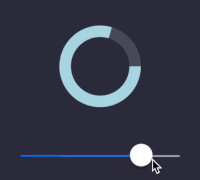

# react-native-progress-wheel
<a href="https://www.npmjs.com/package/react-native-progress-wheel"></a>
[](https://www.npmjs.org/package/react-native-progress-wheel)
  <a href="https://www.npmjs.com/package/react-native-progress-wheel"></a>

React Native component for creating natively animated, circular progress wheel.

## Example app


## Why use this component

This implementation is 100% JS, meaning you do not need to use any additional libraries such as 'react-native-svg' and you don't need to do any linking. 😱
This component also sets `useNativeDriver: true`, meaning that all animation is done smoothly on the native side.💖

This package is also SUPER-LIGHTWEIGHT.

Let's compare:

react-native-progress-wheel: Unpacked size: 8.74 kB (this library)

react-native-circular-progress: Unpacked size: 3.38 MB (other popular library)


## Installation

    yarn add react-native-progress-wheel

## Usage
```js
import AnimatedProgressWheel from 'react-native-progress-wheel';

<AnimatedProgressWheel 
    size={120} 
    width={20} 
    color={'yellow'}
    progress={45}
    backgroundColor={'orange'}
/>
```

You can define a progress value, and a value from which to animate when the component is mounted.
The following example will animate from 0% to 45% at a duration of 3 seconds.

```js
<AnimatedProgressWheel
    progress={45}
    animateFromValue={0}
    duration={3000}
/>
```

The progress wheel can be updated using state variables.

```js
<AnimatedProgressWheel
    progress={this.state.sliderProgress}
/>
```



## Configuration

You can configure the component using these props:

Name             | Type                   | Default value           | Description
-----------------|------------------------|-------------------------|--------------
size             | number                 | 200                     | Width and height of circle
width            | number                 | 25                      | Thickness of the progress line
color            | string                 | white                   | Color of the progress line
backgroundColor  | string                 | gray                    | Color of the background progress line
progress         | number (0, 100)        | 0                       | Angle from which the progress starts from
rounded          | boolean                | false                   | Rounds edges
animateFromValue | number (0, 100)        | -1                      | Starting value to animate to progres when component is mounted
duration         | number                 | 600                     | Duration at which to animate the progress.

## FAQ
Q: Does it work in Expo?
A: Yes it does.

Enjoy making smooth animated designs that use the native driver and DON'T require any additional dependencies.
If you like this library please give it a star on GitHub! ⭐️
