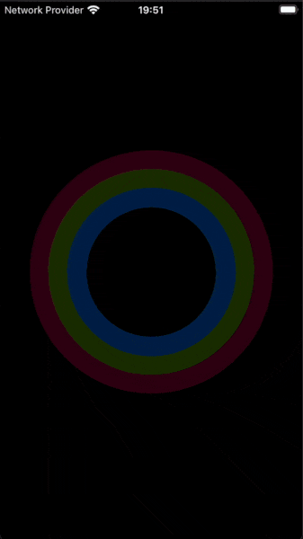

# react-native-progress-wheel

React Native component for creating natively animated, circular progress wheel.

## Example app



## Why use this component

This implementation is 100% react-native, meaning you do not need to use any additional libraries such as 'react-native-svg'. 😱
This component also sets `useNativeDriver: true`, meaning that all animation is done smoothly on the native side.💖

## Installation

    `npm i --save react-native-progress-wheel

## Usage
```js
import { AnimatedProgressWheel } from 'react-native-progress-wheel';

<AnimatedProgressWheel 
    size={120} 
    width={20} 
    color={'yellow'}
    progress={45}
    backgroundColor={'orange'}
/>
```

You can define a progress value, and a value from which to animate when the component is mounted.
The following example will animate from 0% to 45% at a duration of 3 seconds.

```js
<AnimatedProgressWheel
    progress={45}
    animateFromValue={0}
    duration={3000}
/>
```

You can also use a ref to call the components 'animateTo' method to update the progress wheel.

```js
this.progressWheel.animateTo(100, 2000, Easing.quad); // Will fill the progress bar linearly in 2 seconds
```

## Configuration

You can configure the component using these props:

Name             | Type                   | Default value           | Description
-----------------|------------------------|-------------------------|--------------
size             | number                 | 200                     | Width and height of circle
width            | number                 | 25                      | Thickness of the progress line
color            | string                 | white                   | Color of the progress line
backgroundColor  | string                 | gray                    | Color of the background progress line
progress         | number (0, 100)        | 0                       | Angle from which the progress starts from
animateFromValue | number (0, 100)        | -1                      | Starting value to animate to progres when component is mounted
duration         | number                 | 600                     | Duration at which to animate the progress.


`AnimatedProgressWheel` exposes the following functions:

Name        | Arguments                                                           | Description
------------|-----------                                                          |----------------
animateTo   | (toVal: number, duration: number, ease: function)                   | Animate the progress bar to a specific value


Enjoy making smooth animated designs that use the native driver and DON'T require any additional dependencies.
If you like this library please give it a star on GitHub! ⭐️
